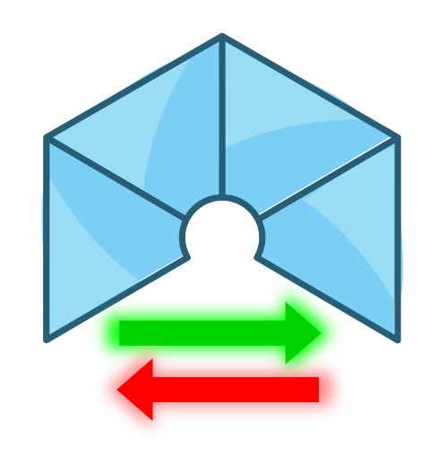

# Stdio Collection

Blocks for Standad Input-Output in different devices.

## Install

* Download the collection: [stable](https://github.com/FPGAwars/Collection-stdio/archive/v0.4.0.zip) or [development](https://github.com/FPGAwars/Collection-stdio/archive/master.zip)
* Install the collection: *Tools > Collections > Add*
* Load the collection: *Select > Collection*

## Blocks
* *Bus*
  * stdin-stdout-adaptor-2
  * stdin-stdout-adaptor
  * *stdin*
    * stdin-enable
    * stdin-joiner
    * stdin-mixer
    * stdin-spliter
  * *stdout*
    * adder-data-tic
    * joiner-2-data-tic
    * next-in
    * next-out
    * spliter-2-data-tic
* *Debug*
  * Hterm-toggle
  * Print-str
  * PrintLn-Char
  * PrintLn-OK
  * PrintLn-base-4
  * PrintLn-bit
  * hterm-bit-stdout
  * hterm-bit
  * hterm-bitx2
  * virtual-toggle-button
  * *Memory*
    * *02-bits*
      * Print-ram-2x1-bit
* *Device*
  * Serial-rx
  * Serial-tx
  * stdin-bin-keyboardX4
  * stdin-serial
  * stdout-LEDs-8
  * stdout-serial
* *Others*
  * *Filters*
    * Printable-nl-del
  * *Getc*
    * Getc-bit
    * Getc-char
    * Getc-printable-char
  * *InputLn*
    * inputln-2xchars-echo
    * inputln-bit-echo
    * inputln-bitx2-echo
    * inputln-char-echo
  * *Input_*
    * input-bit-echo
    * input-bit
    * input-printable-char-echo
    * input-printable-char
  * *Print*
    * Print-base4-bin
    * Print-str-02
    * Print-str-04
    * Print-str-08
    * Print-str-128
    * Print-str-16
    * Print-str-256
    * Print-str-32
    * Print-str-64
    * *asc*
      * Print-asc-02
      * Print-asc-04
      * Print-asc-08
      * Print-asc-128
      * Print-asc-16
      * Print-asc-256
      * Print-asc-32
      * Print-asc-64
  * *PrintLn*
    * PrintLn-BitVar
    * PrintLn-OK
    * PrintLn-base-4
    * PrintLn-bit
    * PrintLn-char
  * *Putc*
    * putc-base4
    * putc-bit
    * putc-char-const
    * putc-char
  * *Regs*
    * 08-bits-shift-right-load-rst
  * *Syntax*
    * Syntax-ELSE
    * Syntax-EOL
    * Syntax-bit
    * Syntax-char

## Examples
* *Debug*
  * 2x1-bits-memory-test
  * Base4-counter
  * Hello-world
  * Hterm-toggle-LED
  * Mini-local-input-console-test-01
  * Mini-local-input-console-test-02
  * hterm-bit-stdout-test-1-2x1-memory
  * hterm-bit-stdout-test-2-one-element-stack
  * hterm-bit-stdout-test-3-two-elements-stack
  * hterm-bit-test-1
  * hterm-bitx2-test-1-LEDs
  * ok-button
  * virtual-toggle-button-test
* *General*
  * 01-print-matrix
  * 02-Button-state-ANSI
  * 03-cowsay-bin
  * 04-NOT-truth-table
  * 05-ram-2x1-bit-test-term
  * 06-Hcalc-acumulator
  * 07-Hcalc-terminal
  * 08-Hcalc-expresion
  * 09-Hcalc-stack
  * 10-Hcalc-two-elements-stack
  * 11-Hcalc-2bits-acumulator
* *Getc*
  * getc-bit-01
  * getc-bit-02
  * getc-bit-03
  * getc-char-01
  * getc-char-02
  * getc-char-03
  * getc-pritnable-char-01
* *InputLn*
  * inputln-bit-test-01-led-on-off
  * inputln-bitx2-test-01-LEDs
  * inputln-char-test-01-LEDs
  * inputln-charx2-cmd-echo
* *Input_*
  * Input-bit-01
  * Input-bit-02
  * Input-bit-03
  * Input-bit-04
  * Input-bit-05
  * input-printable-char-01
  * input-printable-char-echo-01
* *Input_echo*
  * 01-input-bit-button
  * 02-input-bit-hterm-01
  * 03-input-bit-hterm-02
* *Print*
  * Print-01-two-buttons
  * Print-02-two-buttons-ASCII-art
  * Print-03-menu
  * Print-04-str-two-buttons
  * Print-base4-bin-01-counter
  * Print-base4-bin-02-two-buttons
  * *Test*
    * *asc*
      * Test-print-asc-02
      * Test-print-asc-04
      * Test-print-asc-08
      * Test-print-asc-128
      * Test-print-asc-16
      * Test-print-asc-256
      * Test-print-asc-32
      * Test-print-asc-64
    * *str*
      * Test-print-str-02
      * Test-print-str-04
      * Test-print-str-08
      * Test-print-str-128
      * Test-print-str-16
      * Test-print-str-256
      * Test-print-str-32
      * Test-print-str-64
* *PrintLn*
  * PrintLn-BitVar-01
  * PrintLn-base4-01-counter
  * PrintLn-bit-01-button
  * Println-ok-01-button
* *Putc*
  * *Putc-Base-4*
    * putc-base4-01
  * *Putc-bit*
    * putc-bit-01
    * putc-bit-02
    * putc-bit-03-button-changed
    * putc-bit-04-two-buttons
    * putc-bit-05-two-buttons2
    * putc-bit-06-AND-test
    * putc-bit-07-AND-test2
  * *Putc-char*
    * putc-char-01
    * putc-char-02
    * putc-char-03
    * putc-char-04
    * putc-char-05
    * putc-char-06
    * putc-char-07
    * putc-char-08
* *Syntax*
  * Syntax-char-toggle-led
* *stdin-stdout*
  * stdout-LEDx8-test-01
  * stdout-LEDx8-test-02
  * stdout-LEDx8-test-03
  * stdout-LEDx8-test-04
  * stdout-LEDx8-test-05

## Authors
* [Juan González-Gómez (Obijuan)](https://github.com/Obijuan)

## License

Licensed under [GPL-2.0](https://opensource.org/licenses/GPL-2.0).
